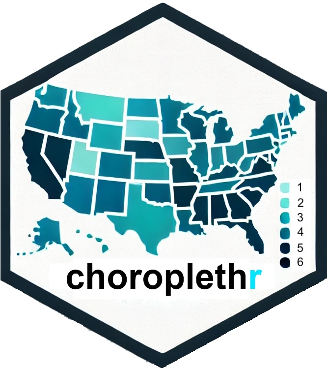
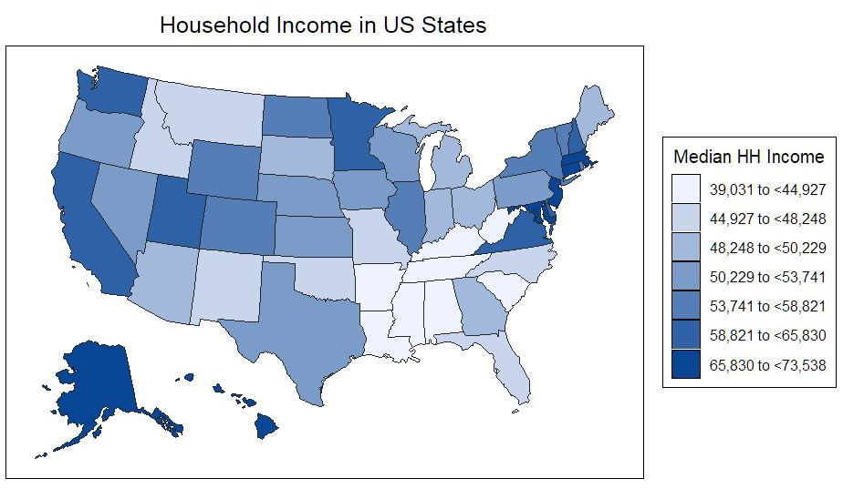
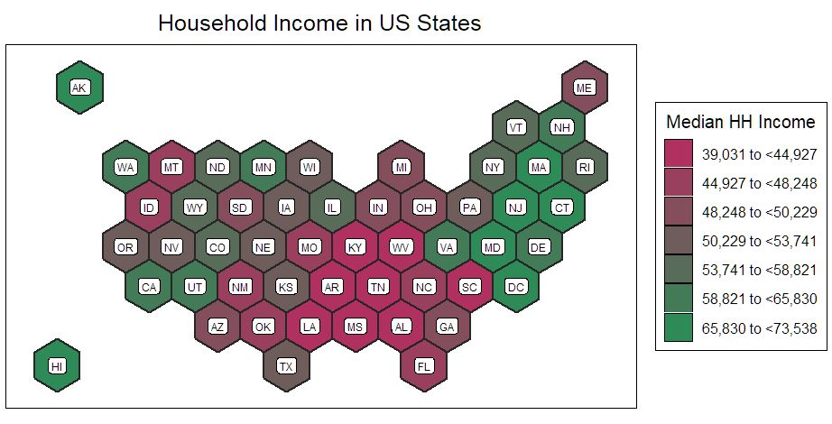
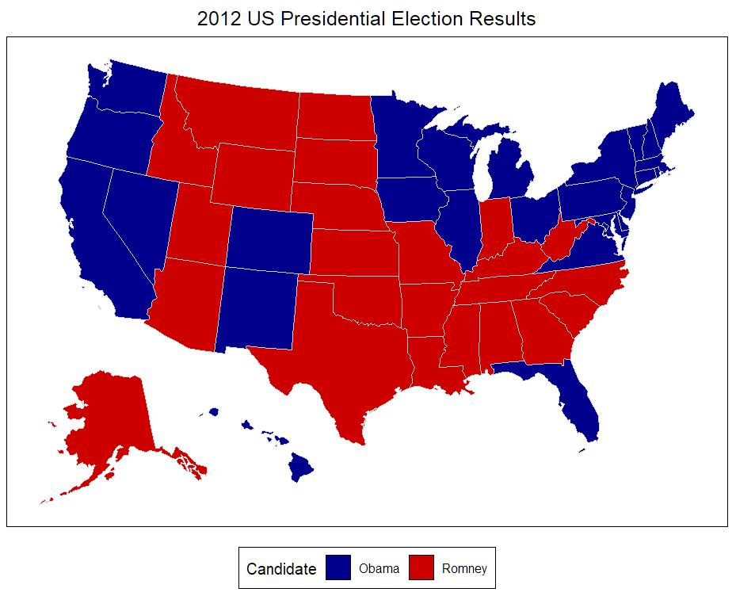
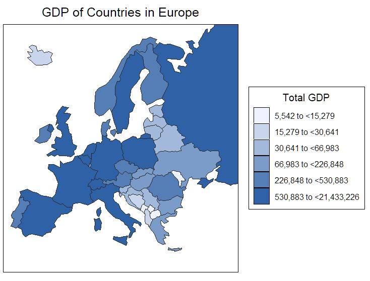

<!-- badges: start -->

[](https://github.com/arilamstein/choroplethr/actions/workflows/R-CMD-check.yaml)

<!-- badges: end -->

# Choroplethr


Choroplethr makes it easy to create color-coded (choropleth) maps in R. No knowledge of cartography or shapefiles needed; go directly from your geographically identified data to a highly customizable map with a single line of code! Supported geographies: U.S. states, counties, and census tracts, world countries and sub-country regions (e.g., provinces, prefectures, etc.).

## 📦 Installation

Install from CRAN:

``` r
install.packages("choroplethr")
```

Install the development version from GitHub:

``` r
# install.packages("remotes")
remotes::install_github("eastnile/choroplethr")
```

## Basic Usage

Create a map using your state level data:

``` r
#library(choroplethr)
my_state_data = choroplethr::df_state_demographics
head(my_state_data) # Data organized by state names in lower case
```

| region   | population | median_hh_income |
|:---------|-----------:|-----------------:|
| alabama  |    4799277 |            43253 |
| alaska   |     720316 |            70760 |
| arizona  |    6479703 |            49774 |
| arkansas |    2933369 |            40768 |

``` r
state_choropleth(my_state_data, geoid.name = 'region', value.name = 'median_hh_income',
                 legend = 'Median HH Income', title = 'Household Income in US States')
```

<p align="center">

</p>

Choroplethr accepts a variety of ways to identify each state, such as proper name, abbreviation, or FIPS code, and will automatically try to determine the type of identifier used, if unspecified. To see the list of accepted identifiers, see ?state_choropleth or choroplethr::state.regions.

Many options are available to customize the appearance of the map:

``` r
state_choropleth(my_state_data, geoid.name = 'region', value.name = 'median_hh_income',
                 legend = 'Median HH Income', title = 'Household Income in US States',
                 legend_position = 'right', color.max = 'seagreen', color.min = 'maroon',
                 border_thickness = .7, label = 'state.abb', style = 'hexgrid',
                 projection = 'mercator')
```

<p align="center">

</p>

Categorical data can also be plotted, with your choice of colors:

``` r
df_president = choroplethr::df_president
state_choropleth(df = df_president, geoid.name = 'region', value.name = 'value',
                 title  = "2012 US Presidential Election Results",
                 legend = "Candidate", custom.colors = c('blue4', 'red3'),
                 border_color = 'lightgrey', legend_position = 'bottom')
```

<p align="center">

</p>

## Other Geographies

Choroplethr current supports five different map types:

-   U.S. State level maps: **state_choropleth()**
-   U.S. County level maps: **county_choropleth()**
-   U.S. Census tract level maps: **tract_choropleth()**
-   World maps by country: **country_choropleth()**
-   World maps by sub-country administrative regions (ie, provinces, prefectures, etc): **admin1_choropleth()**

For example:
``` r
df_country_demographics = choroplethr::df_country_demographics
country_choropleth(df_country_demographics, geoid.name = 'region', geoid.type = 'iso_a3',
                   value.name = 'gdp', continent_zoom = 'Europe', projection = 'albers',
                   title = "GDP of Countries in Europe", legend = 'Total GDP')
```

<p align="center">

</p>

Please see the help documentation inside R (e.g. ?country_choroplethr) to learn more about these functions.

Note: admin1_choropleth() requires the rnaturalearthhires package to be installed.
This package contains the needed high resolution subcountry maps, but is not
presently hosted on CRAN due to its large file size. To use admin1_choropleth,
please first install the remotes package, then install rnaturalearthhires from
github:

``` r
# install.packages("remotes")
remotes::install_github('ropensci/rnaturalearthhires')
```

## For users of older versions of choroplethr:

Version 5 of the package contains many new changes to improve the appearance
and customization of the maps produced; some of these changes are not backwards
compatible with previous versions of choroplethr. If you need everything to work
in exactly the same manner as before, please follow these instructions to install
the previous versions of choroplethr from the CRAN archive:

https://cran.r-project.org/src/contrib/Archive/choroplethr/

Copy the URL of the version you require, then paste this URL into the following
command in R (I'm using version 3.7.3 as an example):

``` r
install.packages(
  'https://cran.r-project.org/src/contrib/Archive/choroplethr/choroplethr_3.7.3.tar.gz',
  repos = NULL,
  type = "source"
)
```

## Technical Support

If you have a technical question about Choroplethr, please contact the maintainer at: [zhaochen.he\@cnu.edu](mailto:zhaochen.he@cnu.edu){.email}.
